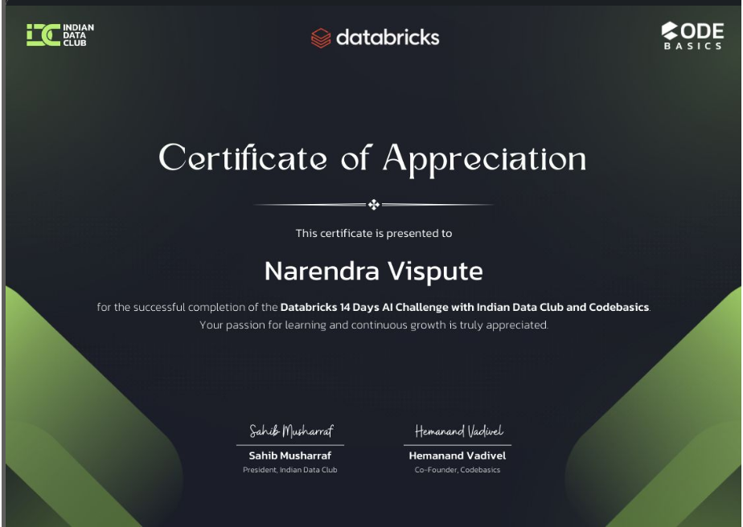

# 🚀 Databricks 14 Days AI Challenge

<p align="center">
  
</p>

<p align="center">
  
  
  
  
  
  
</p>

---

# 🎯 About This Repository

This repository contains my complete work and learnings from the **Databricks 14 Days AI Challenge**, organized by **Databricks**, **Indian Data Club**, and **Codebasics**.

The challenge covered:

✅ Databricks Fundamentals  
✅ Apache Spark & PySpark  
✅ Delta Lake & Lakehouse Architecture  
✅ Medallion Architecture  
✅ Unity Catalog & Governance  
✅ SQL Analytics & Dashboards  
✅ Performance Optimization  
✅ MLflow & MLOps  
✅ Spark ML Pipelines  
✅ AI-Powered Analytics with Genie & Mosaic AI

---

# 🏆 Certificate of Appreciation

<p align="center">
  
</p>

---

# 📅 14 Days Learning Journey

| Day | Topic |
|-----|--------|
| Day 1 | Databricks Foundation |
| Day 2 | Apache Spark Fundamentals |
| Day 3 | PySpark Transformations |
| Day 4 | Delta Lake Introduction |
| Day 5 | Delta Lake Advanced |
| Day 6 | Medallion Architecture |
| Day 7 | Workflows & Job Orchestration |
| Day 8 | Unity Catalog Governance |
| Day 9 | SQL Analytics & Dashboards |
| Day 10 | Performance Optimization |
| Day 11 | Statistical Analysis & ML Prep |
| Day 12 | MLflow Basics |
| Day 13 | Model Comparison & Feature Engineering |
| Day 14 | AI-Powered Analytics: Genie & Mosaic AI |

---

# 📂 Repository Structure

```text
Databricks-14-Days-AI-Challenge
│
├── notebooks/
│   ├── Day01_Foundation.ipynb
│   ├── Day02_Spark_Fundamentals.ipynb
│   ├── Day03_PySpark_Transformations.ipynb
│   ├── Day04_Delta_Lake.ipynb
│   ├── Day05_Delta_Advanced.ipynb
│   ├── Day06_Medallion_Architecture.ipynb
│   ├── Day07_Workflows.ipynb
│   ├── Day08_Unity_Catalog.ipynb
│   ├── Day10_Performance_Optimization.ipynb
│   ├── Day11_Statistical_Analysis.ipynb
│   ├── Day12_MLflow_Basics.ipynb
│   ├── Day13_Model_Comparison.ipynb
│   └── Day14_Genie_Mosaic_AI.ipynb
│
├── screenshots/
│   ├── Day09_SQL_Query.png
│   ├── Day09_Dashboard.png
│   ├── MLflow_UI.png
│   └── Other_Screenshots.png
│
├── certificate/
│   └── certification.png
│
└── README.md
```

---

# 🛠️ Technologies Used

- Databricks
- Apache Spark
- PySpark
- Delta Lake
- SQL
- Unity Catalog
- MLflow
- Scikit-Learn
- Machine Learning
- Generative AI
- Mosaic AI

---

# 💡 Key Learnings

✔ Building Lakehouse architectures on Databricks

✔ Processing big data using Apache Spark

✔ Implementing Medallion Architecture

✔ Managing data governance with Unity Catalog

✔ Creating SQL analytics dashboards

✔ Performance tuning and optimization techniques

✔ Experiment tracking with MLflow

✔ Building scalable Spark ML Pipelines

✔ Exploring AI-powered analytics using Genie & Mosaic AI

---

# 📸 Project Screenshots

## SQL Dashboard

Add your dashboard screenshots inside:

```text
screenshots/
```

---

## MLflow Experiments

Add your MLflow screenshots inside:

```text
screenshots/
```

---

# 🎓 Challenge Outcome

This challenge strengthened my understanding of:

- Data Engineering
- Data Analytics
- MLOps
- AI & Generative AI
- End-to-End Databricks Workflows

---

# 🙏 Acknowledgements

Special thanks to:

❤️ Databricks  
❤️ Indian Data Club  
❤️ Codebasics

for creating such an incredible hands-on learning experience.

---

# 👨‍💻 About Me

### Narendra Vispute

🚀 Data Analyst | Data Scientist | AI & ML Enthusiast

💡 Building AI-Powered Automation Projects

📚 Passionate about Data Engineering, Machine Learning & Generative AI.

---

# 🌐 Connect With Me

<p align="left">

<a href="https://github.com/TechNarendra25">

</a>

<a href="https://www.linkedin.com/in/YOUR-LINKEDIN/">

</a>

</p>

---

# ⭐ If you found this repository useful, please consider giving it a Star!

<p align="center">
⭐ Thank you for visiting my repository! ⭐
</p>
